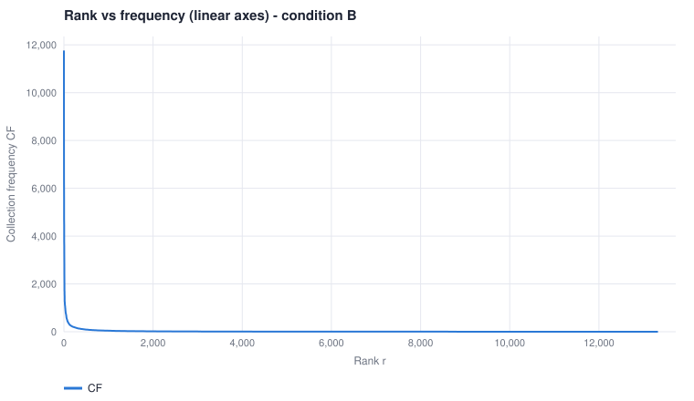
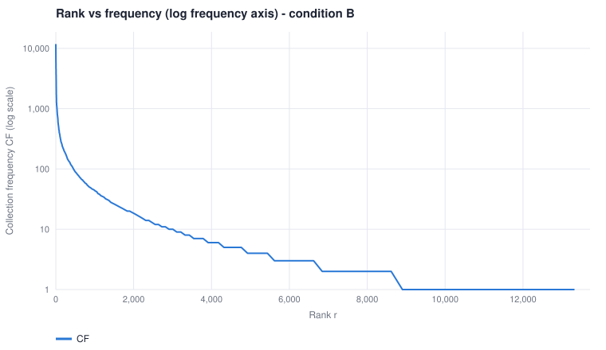
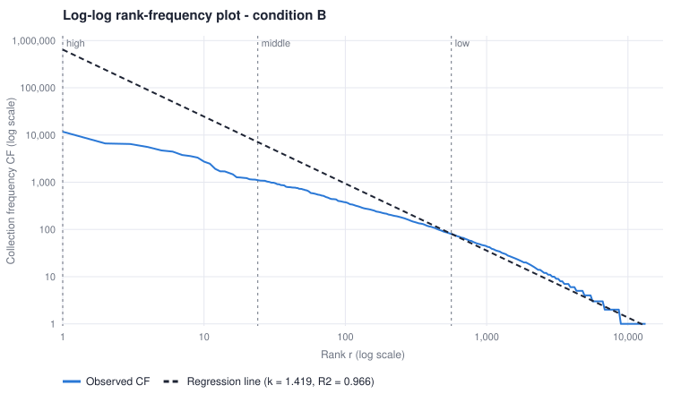
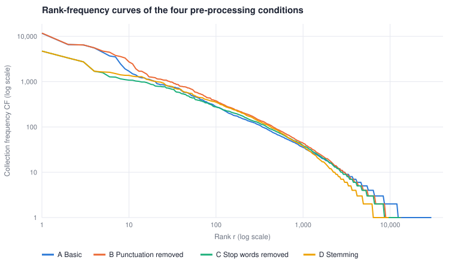

# Project #2 — Zipf's Law, Word2Vec 與拼字校正

作者：胡元楨（P77141105）· 人工智慧資訊檢索

本報告的所有數字都由本專案的程式算出，可用下列指令重現（或在網頁的 **Zipf 分析** 分頁互動檢視）：

```
python3 cli.py collect "GLP-1" -n 1000 --name glp1     # 建立語料（已附在 data/pubmed_glp1.jsonl）
python3 cli.py zipf --cond B --svg report/             # 詞彙統計、Top 50、迴歸、四種條件比較、圖
python3 cli.py terms --cond C                          # CF / DF / IDF 表
```

> 語料是 2026-10-04 以 PubMed 查詢 `GLP-1` 取得的最新 1,000 篇；重新下載會得到不同的文章，數字會略有變動。

## 1. Dataset

| 項目 | 內容 |
|---|---|
| 來源 | PubMed（E-utilities `esearch` + `efetch`），查詢 `(GLP-1) AND english[lang] AND hasabstract`，依出版日期由新到舊取前 1,000 篇 |
| 文件數 | 1,000 篇，皆為英文、皆有摘要 |
| Document ID | PMID（系統內為 `PMID<number>`） |
| 分析文字 | 每篇的 title + abstract |
| 儲存 | `data/pubmed_glp1.jsonl`（一行一篇：pmid, title, abstract, journal, year, authors, keywords, doi） |

## 2. Part I — Text preprocessing

| 步驟 | 實作（`ir/zipf.py: terms_for`、`ir/tokenizer.py`、`ir/stopwords.py`、`ir/porter.py`） |
|---|---|
| Tokenization | 條件 A 以空白切分；條件 B 起以「連續的字母或數字」為一個 token（regex `[^\W_]+`） |
| Case folding | 全部轉小寫：`Data`, `data`, `DATA` → `data` |
| Punctuation | 條件 B 起標點、連字號、括號皆為分隔符：`data,` `data.` `data;` → `data`；`GLP-1` → `glp`, `1` |
| Stopwords | 兩種版本：保留（條件 B）與移除（條件 C）；清單為 Snowball 174 字 + 17 個生醫補充詞 |
| Stemming | 條件 D：自行實作的 Porter stemmer（1980 年論文的五個步驟） |

四種條件是累加的：**A** 基本（空白斷詞 + 小寫）→ **B** 去標點 → **C** 去停用詞 → **D** stemming。

## 3. Part II — Vocabulary

| Condition | Documents | Total tokens | Unique terms | Avg tokens / doc |
|---|---:|---:|---:|---:|
| A Basic | 1,000 | 263,453 | 29,758 | 263.5 |
| **B Punctuation removed** | 1,000 | 286,598 | 13,323 | 286.6 |
| C Stop words removed | 1,000 | 212,155 | 13,195 | 212.2 |
| D Stemming | 1,000 | 212,155 | 9,614 | 212.2 |

以下 Part III–V 以條件 B（保留停用詞、未 stemming）為主要分析對象，因為它最接近「自然語言本身」的詞頻分布。

## 4. Part III / IV — Collection frequency 與 Document frequency

`CF(t)` = t 在整個語料出現的總次數；`DF(t)` = 含有 t 的文件數。Top 50（條件 B，依 CF 排序）：

| Rank | Term | CF | DF | Rank | Term | CF | DF |
|---:|---|---:|---:|---:|---|---:|---:|
| 1 | and | 11,762 | 999 | 26 | peptide | 1,078 | 720 |
| 2 | of | 6,613 | 982 | 27 | risk | 1,074 | 424 |
| 3 | the | 6,454 | 984 | 28 | agonists | 1,029 | 600 |
| 4 | in | 5,574 | 975 | 29 | glucagon | 1,014 | 716 |
| 5 | 1 | 4,720 | 955 | 30 | associated | 980 | 504 |
| 6 | with | 4,454 | 925 | 31 | like | 980 | 723 |
| 7 | to | 3,777 | 955 | 32 | metabolic | 951 | 384 |
| 8 | a | 3,580 | 946 | 33 | treatment | 909 | 448 |
| 9 | glp | 3,325 | 774 | 34 | that | 905 | 508 |
| 10 | 0 | 2,731 | 414 | 35 | 95 | 870 | 265 |
| 11 | for | 2,473 | 869 | 36 | from | 867 | 523 |
| 12 | were | 1,919 | 587 | 37 | outcomes | 856 | 409 |
| 13 | was | 1,701 | 594 | 38 | study | 803 | 448 |
| 14 | 2 | 1,694 | 627 | 39 | semaglutide | 791 | 237 |
| 15 | receptor | 1,574 | 799 | 40 | clinical | 785 | 448 |
| 16 | or | 1,467 | 575 | 41 | effects | 784 | 436 |
| 17 | weight | 1,274 | 421 | 42 | p | 773 | 237 |
| 18 | obesity | 1,260 | 478 | 43 | type | 770 | 437 |
| 19 | on | 1,240 | 620 | 44 | ci | 769 | 227 |
| 20 | this | 1,223 | 742 | 45 | are | 757 | 486 |
| 21 | patients | 1,153 | 404 | 46 | we | 752 | 467 |
| 22 | as | 1,139 | 574 | 47 | these | 728 | 516 |
| 23 | is | 1,137 | 610 | 48 | use | 725 | 323 |
| 24 | diabetes | 1,108 | 534 | 49 | disease | 722 | 330 |
| 25 | by | 1,083 | 586 | 50 | evidence | 706 | 384 |

功能詞（and, of, the, in）之外，榜上有主題詞（glp, receptor, weight, obesity, semaglutide）以及摘要特有的統計符號（`1`、`0`、`95`、`p`、`ci`——來自 “GLP-1”、“0.05”、“95% CI”）。

## 5. Part V — Zipf distribution

### Experiment 1 — Rank vs frequency

線性座標下曲線完全貼著兩軸（前幾個詞的頻率上萬，而 13,323 個詞中有 4,703 個只出現一次），看不出分布形狀；把頻率軸取對數後才能看到整條長尾。




### Experiment 2 — Log-log plot 與 linear regression

對所有 13,323 個 (rank, CF) 點做 OLS：`log10(CF) = a − b · log10(r)`。



| Range | Ranks | Slope | Intercept | Zipf exponent k | R² | RMSE | Token 佔比 | 相對整體迴歸線的平均殘差 |
|---|---:|---:|---:|---:|---:|---:|---:|---:|
| **Whole curve** | 1 – 13,323 | −1.4188 | 5.8082 | **1.4188** | 0.9662 | 0.1150 | 100% | 0 |
| High-frequency | 1 – 23 | −0.8191 | 4.1860 | 0.8191 | 0.9482 | 0.0672 | 25.2% | −1.04 |
| Middle-frequency | 24 – 561 | −0.8607 | 4.2934 | 0.8607 | 0.9975 | 0.0136 | 42.3% | −0.19 |
| Low-frequency | 562 – 13,323 | −1.6025 | 6.5071 | 1.6025 | 0.9798 | 0.0734 | 32.5% | +0.01 |

三段是把 log(rank) 軸三等分後各自再做一次迴歸；RMSE 的單位是 log10 頻率。

### Required analysis

**Q1. Does the collection follow Zipf's Law?**
近似符合，但不是嚴格符合。log-log 圖整體呈現明顯的線性下降趨勢（R² = 0.966），而且 rank 24–561 的中段幾乎是完美直線（R² = 0.9975）。但曲線並非單一直線：頭部比直線平（前 23 個詞的實際頻率比整體迴歸線的預測低了約一個數量級，平均殘差 −1.04），尾部則向下彎並呈階梯狀。也就是說它符合 Zipf's law 所描述的「少數詞極常見、多數詞極罕見」的冪次律型態，但用一條斜率固定的直線描述整條曲線並不精確。

**Q2. What is your estimated Zipf exponent?**
整條曲線的 OLS 估計為 **k = 1.42**（slope = −1.4188, intercept = 5.8082）。只看中頻段則為 k = 0.86，較接近理想值 1。整體估計偏高的原因是：未加權的 OLS 中每個 rank 是一個資料點，而 96% 的資料點（12,762 個詞）落在低頻段，所以整體斜率幾乎就是尾部的斜率（k = 1.60）；語料只有 1,000 篇摘要，尾部會因為詞彙尚未飽和而提早下墜。

**Q3. Is R² sufficient to prove that the distribution follows Zipf's Law?**
不足，理由有三：

1. rank–frequency 資料是排序過的，必然單調遞減；任何重尾分布（lognormal、stretched exponential、Zipf–Mandelbrot）畫在 log-log 圖上都會得到很高的 R²，高 R² 無法區分這些模型。
2. R² 看不到系統性偏差。本例 R² = 0.966，但三段的斜率分別是 0.82 / 0.86 / 1.60，殘差不是隨機散布而是隨 rank 有規律地變化（−1.04 / −0.19 / +0.01），代表模型設定有誤。
3. log-rank 軸上的點極度不均勻（多數點擠在尾部），且尾部有大量頻率相同的詞（ties），OLS 的獨立同分布假設不成立，R² 與斜率都被尾部主導。

要更嚴謹應該：看殘差圖與分段斜率（本報告的做法）、用 maximum likelihood 估計指數並以 Kolmogorov–Smirnov 檢定做 goodness-of-fit（Clauset et al., 2009）、並與替代模型做 likelihood ratio 比較。

**Q4. Which portion of the rank-frequency curve fits Zipf's Law best?**
**中頻段（rank 24–561）**：RMSE = 0.0136、R² = 0.9975，遠優於其他兩段，斜率 0.86 也最接近 1。

- 高頻段（rank 1–23）：只有 23 個點，多為功能詞與本語料的主題詞；它們的頻率彼此接近（and 之後 of / the / in 幾乎一樣多），曲線較平（k = 0.82），這是 Zipf–Mandelbrot 修正項 `f ∝ 1/(r+β)^k` 所描述的現象。
- 低頻段（rank 562 以後）：頻率只能是整數，出現 1 次的詞有 4,703 個（35.3%）、形成長長的水平階梯；語料小使罕見詞取樣不足，曲線向下彎（k = 1.60）。

## 6. Part VI — Effect of preprocessing



| Condition | Tokens | Vocabulary | Hapax 佔比 | Top-10 佔 token | k（整體） | R² | RMSE | k（高/中/低頻段） | Top terms |
|---|---:|---:|---:|---:|---:|---:|---:|---|---|
| A Basic | 263,453 | 29,758 | 58.5% | 18.2% | 1.098 | 0.958 | 0.100 | 0.89 / 0.89 / 1.10 | and of the in with to a for |
| B Punctuation removed | 286,598 | 13,323 | 35.3% | 18.5% | 1.419 | 0.966 | 0.115 | 0.82 / 0.86 / 1.60 | and of the in 1 with to a |
| C Stop words removed | 212,155 | 13,195 | 35.6% | 9.4% | 1.370 | 0.960 | 0.122 | 0.56 / 0.77 / 1.57 | 1 glp 0 2 receptor weight obesity patients |
| D Stemming | 212,155 | 9,614 | 34.4% | 10.1% | 1.482 | 0.959 | 0.133 | 0.48 / 0.79 / 1.71 | 1 glp 0 2 receptor us agonist studi |

**How does preprocessing affect the Zipf distribution?**

1. **Vocabulary size.** 影響最大的是標點處理：A→B 詞彙從 29,758 降到 13,323（−55%），因為 `obesity`、`obesity,`、`obesity.`、`(obesity` 在條件 A 是四個不同的詞。同時 token 數反而增加（263k → 287k），因為連字號與斜線把 `GLP-1` 這類複合詞切成兩個 token。移除停用詞只少了 128 個詞型（−1%），但 token 少了 26%。Stemming 把詞形變化合併，詞彙再減 27%（13,195 → 9,614；例如 compared / comparative / compare / comparator… 10 個詞形 → `compar`）。
2. **High-frequency terms.** A、B 的榜首全是功能詞，前 10 名佔全部 token 的 18.5%。移除停用詞後榜首換成主題詞（glp, receptor, weight, obesity, patients），前 10 名只佔 9.4%——頭部被「削平」。Stemming 後同詞幹的頻率相加（patients 1,153 + patient → `patient` 1,377；use/used/using → `us` 1,612），高頻詞的 CF 上升、排名重新洗牌。
3. **Zipf exponent.** 整體 k：A 1.10 → B 1.42 → C 1.37 → D 1.48。A 的 k 最接近 1 其實是假象：黏著標點的詞製造了大量 hapax（58.5%），把尾巴拉長拉平。去標點後尾巴縮短、整體斜率變陡。移除停用詞砍掉了最高的頭部，高頻段變得很平（k 0.82 → 0.56），整體 k 略降。Stemming 讓詞彙變小而總 token 不變，中段抬高、尾段更陡（1.57 → 1.71），整體 k 上升。
4. **Shape of the distribution.** 四條曲線的中段近乎平行（k ≈ 0.77–0.89），差異集中在兩端：頭部在移除停用詞後出現明顯的「肩膀」（平台），尾部則是詞彙越小越早觸底。R² 都在 0.96 左右，但 RMSE 由 A 到 D 逐步上升（0.100 → 0.133），表示前處理越多、曲線越偏離單一直線。前處理改變的是截距與頭尾形狀，沒有改變長尾分布的本質。

**Porter stemming 的效果（C→D）：** 13,195 個詞 → 9,614 個詞幹，其中 2,031 個詞幹合併了兩個以上的詞形。合併最多的例子：`gener`（generally, generating, generation, general, generated…共 13 種）、`compar`（10 種）、`activ`（activity, activation, active, activated…10 種）。前者同時也是 over-stemming 的例子（generation 與 general 意義不同）。

## 7. Part VII — CF vs DF

條件 C（去停用詞、未 stemming），N = 1,000：

| Term | CF | DF | CF / DF | DF / N |
|---|---:|---:|---:|---:|
| glp | 3,325 | 774 | 4.30 | 77.4% |
| receptor | 1,574 | 799 | 1.97 | 79.9% |
| weight | 1,274 | 421 | 3.03 | 42.1% |
| obesity | 1,260 | 478 | 2.64 | 47.8% |
| patients | 1,153 | 404 | 2.85 | 40.4% |
| diabetes | 1,108 | 534 | 2.07 | 53.4% |
| agonists | 1,029 | 600 | 1.72 | 60.0% |
| study | 803 | 448 | 1.79 | 44.8% |
| semaglutide | 791 | 237 | 3.34 | 23.7% |
| glucose | 661 | 346 | 1.91 | 34.6% |
| results | 616 | 538 | 1.14 | 53.8% |
| cardiovascular | 588 | 218 | 2.70 | 21.8% |
| insulin | 497 | 188 | 2.64 | 18.8% |
| tirzepatide | 455 | 143 | 3.18 | 14.3% |
| kidney | 438 | 135 | 3.24 | 13.5% |
| surgery | 273 | 102 | 2.68 | 10.2% |
| placebo | 251 | 86 | 2.92 | 8.6% |
| liraglutide | 226 | 85 | 2.66 | 8.5% |
| bariatric | 186 | 76 | 2.45 | 7.6% |
| mice | 174 | 69 | 2.52 | 6.9% |
| masld | 170 | 40 | 4.25 | 4.0% |
| cells | 169 | 85 | 1.99 | 8.5% |
| orforglipron | 126 | 22 | 5.73 | 2.2% |
| asthma | 51 | 7 | 7.29 | 0.7% |
| pancreatitis | 46 | 15 | 3.07 | 1.5% |
| alzheimer | 43 | 23 | 1.87 | 2.3% |
| nausea | 32 | 30 | 1.07 | 3.0% |
| retinopathy | 18 | 10 | 1.80 | 1.0% |

**Q1. Why can a term have a high CF but relatively low DF?**
因為它是少數文件的「主題」：只有少數文件談它，但談它的文件會反覆提到它。`orforglipron` 只出現在 22 篇，但平均每篇 5.7 次；`asthma` 只有 7 篇卻有 51 次（7.3 次/篇）。相對地，`results`（538 篇、每篇 1.14 次）與 `nausea`（30 篇、每篇 1.07 次）這種詞每篇只提一次——前者是摘要的結構用語，後者通常只在副作用清單裡出現一次。這種「出現就會連續出現」的性質稱為 burstiness，是內容詞的特徵。

**Q2. Which measure tells us whether a term is widely distributed across documents?**
DF（或 DF/N）。CF 只給總量，無法區分「1,000 篇各出現 1 次」與「10 篇各出現 100 次」。例如 `semaglutide`（CF 791）與 `study`（CF 803）的 CF 幾乎相同，但 DF 分別是 237 與 448，後者的分布廣了近一倍。

**Q3. Why are CF and DF both important in IR?**
- DF 決定 IDF，也就是詞的鑑別力；DF 也是 posting list 的長度，直接決定查詢處理的成本與 AND 查詢的合併順序（先處理最短的 list）。
- CF 決定位置索引（positional index）的大小——每一次出現都要存一個位置；在 language-model 檢索中，CF / 總 token 數就是 collection model 的機率，用來做 smoothing；Zipf / Heaps 等語料統計也以 CF 為基礎。
- 兩者的比值 CF/DF 衡量 burstiness，可用來辨識主題詞、挑選關鍵詞或建立停用詞清單（高 DF 且 CF/DF ≈ 1 的詞是好的停用詞候選）。

## 8. Part VIII — Connection to TF-IDF

`idf(t) = log10(N / df(t))`，N = 1,000（條件 C）：

| Term | CF | DF | IDF |
|---|---:|---:|---:|
| receptor | 1,574 | 799 | 0.097 |
| glp | 3,325 | 774 | 0.111 |
| agonists | 1,029 | 600 | 0.222 |
| diabetes | 1,108 | 534 | 0.272 |
| obesity | 1,260 | 478 | 0.321 |
| weight | 1,274 | 421 | 0.376 |
| semaglutide | 791 | 237 | 0.625 |
| insulin | 497 | 188 | 0.726 |
| tirzepatide | 455 | 143 | 0.845 |
| kidney | 438 | 135 | 0.870 |
| liraglutide | 226 | 85 | 1.071 |
| mice | 174 | 69 | 1.161 |
| nausea | 32 | 30 | 1.523 |
| alzheimer | 43 | 23 | 1.638 |
| pancreatitis | 46 | 15 | 1.824 |
| retinopathy | 18 | 10 | 2.000 |

（條件 B 下 `and` 的 DF = 999，idf = 0.0004；`the` 的 DF = 984，idf = 0.007。）

**Why do very common terms generally receive lower IDF values?**
IDF 是 DF 的遞減函數：詞出現在越多文件，N/df 越接近 1，log 後越接近 0。直觀上，一個幾乎每篇文件都有的詞無法幫助區分相關與不相關的文件——在這個 GLP-1 語料裡，`receptor`（80% 的文件）與 `glp`（77%）雖然是「內容詞」，但 idf 只有 0.1，幾乎沒有鑑別力；反而 `retinopathy`（1% 的文件）的 idf 是 2.0。從資訊理論看，idf ≈ −log P(t 出現在文件中)，就是「看到這個詞」所帶來的資訊量。

**Zipf distribution 與 TF-IDF weighting 的關係：**
Zipf's law 說頻率隨 rank 以冪次律下降，所以原始 TF 的動態範圍極大（本語料 CF 從 11,762 到 1），而且排名最前的 10 個詞就佔了 18.5% 的 token。如果只用 TF 計分，查詢與文件的相似度會被這些高頻詞主導。IDF 在 log 尺度上給出與頻率相反的權重——剛好抵銷 Zipf 曲線的頭部；TF 部分通常也取 log（`1 + log tf`）來壓縮冪次律的範圍。同時 Zipf 的長尾表示大部分詞彙 DF 很低、IDF 很高，但它們極少出現在查詢中；真正對檢索有貢獻的是中頻段的詞（Luhn 的 “resolving power” 觀點：最有鑑別力的詞位於 rank-frequency 曲線的中段），TF-IDF 等於依據詞在 Zipf 曲線上的位置重新加權。

## 9. Part IX — Why does Zipf's Law matter to an Information Retrieval system?

Zipf's law describes the raw material every retrieval system has to work with: a handful of terms account for a large share of all tokens, while most of the vocabulary occurs only a few times. In our collection of 1,000 PubMed abstracts the ten most frequent terms cover 18.5% of the 286,598 tokens, and 35% of the 13,323 distinct terms occur exactly once. This skew drives three central design decisions.

**Stopword removal.** The terms at the head of the curve (*and, of, the, in, with*) appear in more than 92% of the documents. A term that is present in nearly every document cannot separate relevant documents from non-relevant ones, so it has almost no discriminative value: matching it tells the system nothing about the user's information need. Because of Zipf's law, removing fewer than 200 such word types deleted 26% of all tokens in our experiment while shrinking the vocabulary by only 1%. Postings for these terms are the longest and most expensive to process, so dropping them saves a great deal of work at a small cost in effectiveness (the main cost being phrase queries such as "to be or not to be", which is why positions are kept).

**Inverted index.** The dictionary size is governed by the long tail: new documents keep contributing rare terms (Heaps' law, the companion of Zipf's law), and our tail is dominated by hapax legomena, numbers and misspellings. The dictionary therefore grows without bound, although slowly, and must be stored compactly. Postings lists inherit the same skew: a few lists are extremely long (999 documents for *and*) and thousands contain a single entry. Total index storage is dominated by the few long lists, but those are exactly the lists that compress best: frequent terms occur in documents that are close together, so the gaps between document IDs are small and variable-byte or gamma codes store them in a few bits. Rare terms have large gaps but only a handful of postings. Zipf's law is the reason gap encoding works, and it also justifies skip pointers, caching the postings of frequent terms, and processing the shortest list first in conjunctive queries.

**TF-IDF.** A term that is frequent in the collection usually occurs in many documents, so its document frequency is high and its inverse document frequency, log(N/df), is close to zero. In our collection *receptor* occurs in 80% of the abstracts and receives an IDF of 0.10, whereas *retinopathy* occurs in 1% and receives 2.0. High-frequency terms have low discriminative power because their presence is nearly independent of the topic of a document; observing them carries little information. IDF converts this observation into a weight and, together with a logarithmic term-frequency component, counteracts the power-law dominance of the head of the Zipf curve. The terms that matter most for ranking end up being the middle-frequency ones: frequent enough to be used in queries and to occur in several documents, rare enough to distinguish them.

In short, Zipf's law explains why stopword lists are short yet effective, why inverted indexes are both feasible and compressible, and why term weighting must discount frequent terms.

## 10. Word embedding（word2vec）

- 實作：`ir/word2vec.py`，純 Python、無第三方套件；Skip-gram 與 CBOW 皆可選，以 negative sampling 訓練（dynamic window、高頻詞 subsampling、unigram^0.75 負樣本表、線性遞減學習率）。
- 前處理：規則式斷句 → 斷詞（保留內部連字號，`glp-1`、`sglt2`）→ 小寫 → 移除停用詞；視窗不跨句。1,000 篇摘要得到 10,794 個句子、176,332 個詞；出現 ≥ 5 次的詞共 4,438 個。
- 隨專案附上的模型（`data/word2vec.json`）：Skip-gram、50 維、window 5、5 個負樣本、10 epochs。

Skip-gram 模型的最近鄰（cosine similarity）範例：

| 查詢詞 | 最相似的詞 |
|---|---|
| semaglutide | dulaglutide, exenatide, low-dose, once-weekly, cagrisema, ecnoglutide |
| nausea | vomiting, diarrhea, constipation, injection-site, aes, gi |
| mice | rats, dio, diet-induced, db, c57bl, high-fat, hfd-fed |
| stroke | infarction, ischemic, hhf, all-cause, revascularization |
| kidney | cardiovascular, renal, ckd, albuminuria, progression |

類比運算 `v(b) − v(a) + v(c)` 的例子：kidney : ckd = liver : **masld**（其後為 non-alcoholic, mafld, steatotic, nafld）；obesity : weight = diabetes : **glycaemic**。語料只有 1,000 篇，類比並不總是成立，但器官—疾病這類在摘要中反覆出現的關係學得出來。

模型學到的是語料中的分布相似性：藥名彼此相近、副作用彼此相近、動物模型相關詞彼此相近。網頁的 **Word2Vec** 分頁可重新訓練（選擇模型與超參數）、查最近鄰、做類比運算並以 PCA 畫出 2-D 分布圖。

## 11. Edit distance 與拼字校正

- `ir/spell.py`：以動態規劃計算 Levenshtein 距離（含 Damerau 相鄰對調），可顯示完整 DP 表與最佳對齊路徑。
- 拼字校正：字典為語料中出現過的 12,541 個詞。先用字元 bigram 索引篩選候選（k 次編輯最多破壞 3k 個 bigram），再以帶狀 DP 驗證（超過 k 即中止），最後依（編輯距離、語料頻率）排序。
- 檢索整合：查詢詞不在語料中時顯示 *Did you mean*；若原查詢沒有結果，自動改用校正後的查詢（例：`semaglutde obesty` → `semaglutide obesity`，140 篇）。`word~` / `word~2` 為模糊比對運算子，展開成編輯距離內的所有詞。
- 檢索結果沿用 Project #1 的呈現：命中詞反白、最佳句子 snippet、各欄位命中位置圖（match map）。
